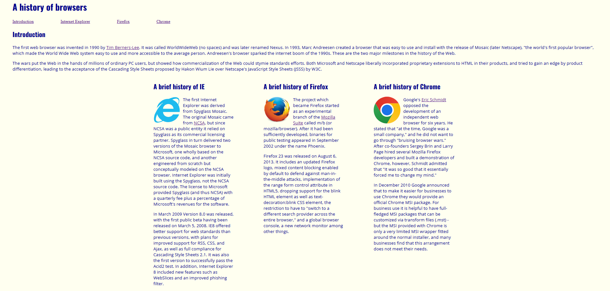
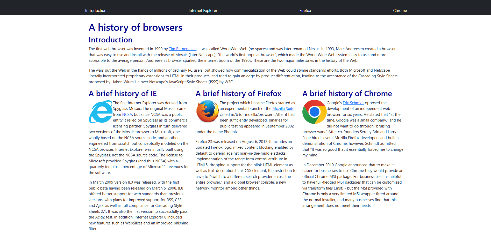

(left image: web page using plain HTML, right image: same web page using Bootstrap 5)

## Analogy
Baking a cake from scratch requires gathering specific ingredients, following detailed procedures, and using the right techniques to produce a high-quality result. However, using cake flour sold at supermarkets simplest the process, requiring fewer ingredients, less time, and fewer steps while still producing a good cake. Similarly, building a webpage with plain HTML and CSS can be time-consuming and complex requiring software developers to write extensive code. UI frameworks like Bootstrap acts like the cake flower, they provide prebuilt designs and styles allowing the process of creating a web page more efficient for developers.

## Benefits of UI Frameworks
UI frameworks are designed to provide pre-built components making web development faster and more efficient for software developers.
They help shorten code, improve readability and maintain consistency, across other web pages. One of the biggest advantages is cross-browser compatibility which ensures a web page to look well structured and works properly on different browsers and devices. 

Bootstrap 5, a UI framework, offers software developers a collection of pre-built features such as navigation bars, links, buttons, grid systems, search bar, textbox, forms, icons, and much more. Developers can use Bootstrap’s built-in classes to avoid manually coding layouts and complex CSS rules.

For example, instead of setting up different sections one at a time for a navigation bar, developers can use a few class names from Bootstrap 5 for the same results.

## Personal Experience
During my experience of using Bootstrap 5, I wanted to create navigation bars. I was amazed by the output of a visually functioning HTML page and the difficulty because it would’ve been more difficult to create all the same features from scratch. It is very frustrating but a good learning experience, more practice with Bootstrap 5 will make the experience a lot more enjoyable. The images attached are one of my attempts to recreate a section of a website which didn’t use Bootstrap 5, with Bootstrap 5. The one on the left is the original, the one on the right is my recreation. Even though they still look very different, I got some hands-on experience along with learning new features.
