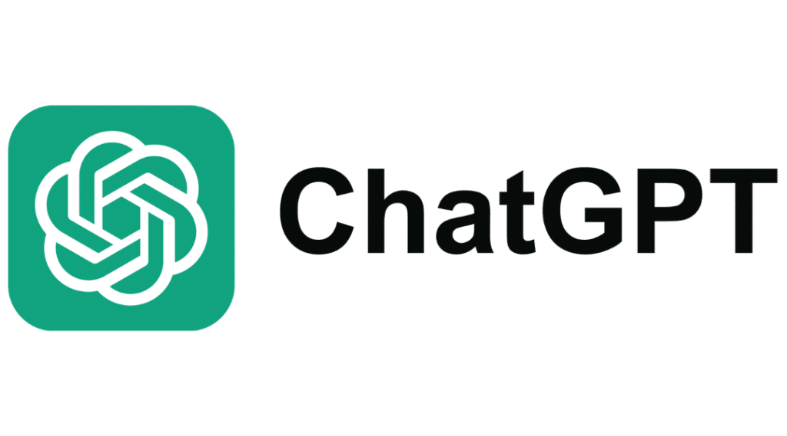

Image Source: [hatchwise]([https://pixabay.com/illustrations/question-question-mark-response-1015308/](https://www.hatchwise.com/resources/the-complete-history-of-the-chatgpt-logo))

## Introduction
The role of AI in education is a tool that students can utilize for learning assistance. It's almost like a 24 hour remote tutor. Although we shouldn’t heavily rely and fully believe what AI tells us (nothing is perfect), the functionality of it being interactive and personalized tailored to each unique individual is useful. Students have different ways of learning at different speeds, so using AI will be useful as it helps students with personalized study methods and advice.

In relevance to Software Engineering, students can ask AI for help when they need help understanding the functionality of a section of code, help explain a concept, help explain errors and bugs, and help scan a section of code for syntax errors students may have not noticed.

In ICS 314, I use ChatGPT to help me figure out why I’m getting errors and bugs in my code. Not only does it suggest possible solutions, it also provides optional tips to consider to prevent future bugs. Sometimes when my thoughts get jumbled up, using ChatGPT helps me organize and structure my ideas more clearly. In general, I use ChatGPT to help me understand difficult concepts in my other classes. I take advantage of its interactive feature by asking a lot of “why” and “how” questions to understand why things work the way they do. ChatGPT does a good job at summarizing large chunks of text so, I prefer to read a simplified version first to get a basic understanding of something, then go back to read the original version of the text to get a more in depth understanding.


## Personal Experience with AI
When I was doing the experience WODs I mainly used AI such as ChatGPT for syntax errors because I would usually already have a plan in my head on what to do but to type the actual code, the syntax of it slows me down. Once I get a bit familiar with it, I would try to avoid using ChatGPT to practice and remember the syntax. For example, E18: Experience Functional Programming 1, was when we first learned how to implement different function calls, I had a basic understanding of what the function calls do, but I needed some help trying to piece everything together. 

The same goes for In-class Practice WODS and In-class WODs. For In-class Practice WODs, I had to be at the same pace with my groupmates and since we couldn’t look at each other's screens, it made it a bit more difficult to discuss the syntax. This was mostly when we were using typescript playground. For In-class WODs, when we started using Visual Studio Code, I had a difficult time with resolving ESLint and Prettier errors because I had no idea what the errors were talking about which occasionally had me exceed the DNF time limit. Even with the help of ChatGPT then, I was still a bit confused. For example, it was one of the In-class Murphys using Next.js, there was something wrong with one of the files that was downloaded from the npx install. Another example was battling against the double and single quote errors.

When I write essays, I usually end up writing overly long sentences which may most likely confuse the reader just as it confuses myself. Luckily with the help of AI, ChatGPT could understand me when I just list all of my thoughts down. It then organizes my thoughts into sentences or a paragraph, and after I read it, I try again to write all of my thoughts into my essay in my own words. Since I could understand what I was trying to say, it was easier to write more clearly. One example is my essay on reflecting on coding standards. I had an idea what ESLint was but I wasn’t sure how to make my words clearly related to the topic.

ChatGPT was really helpful when we were working on our final project because, instead of watching tutorial videos like the Digits experiences, we were left on our own to use the skills we gained from those videos and apply them to our own project. Since Vercel requires a payment plan if we try to deploy our project using github organizations, I decided to use the hobby plan to deploy our project using my personal github account. Some bugs and errors weren’t detected in Visual Studio Code and Github, but were detected when our project was being built in Vercel leading it to not compile. Because of these issues, it made trying to understand our code a bit difficult. ChatGPT was useful when it came to explaining and solving those errors because since deploying Vercel in on my personal account and computer, I couldn’t really ask my teammates for help. For example, when I was trying to upload one of my teammate’s branches, there was a possible null session for a user if they tried to log in but it didn’t seem to be an issue on my teammate’s end.

Since we learn a lot of new concepts and tutorials in this course, reading and trying to do them for the first time on our own was confusing. For example installing pgAdmin, PostgreSQL, Prisma, and Next.js were all new things to me and the readings were long and wordy. ChatGPT did a good job at breaking things down and explaining the concepts to me.

I haven't really answered a question in class or in Discord because I either also don’t understand or someone answers before me. I do take notes and save those questions for later to ask ChatGPT to help explain the answer to me. But if I was able to ask a question, I would ask ChatGPT how I would make my point clear so that the person who asked the question would understand and hope to get the answer that they were looking for.

I noticed that if I ask ChatGPT a smart question, most of the time I get a better answer from it. During the final project, when I get errors deploying on Vercel, I would try to find solutions on my own first then tell ChatGPT what I have done, what I got out of those attempts, and ask if there is anything else I could do. For example, when I was trying to migrate something from the prisma schema, it was hooking up to a different server rather than the supabase one and wouldn’t go through. It provided me with a list of a few things I already did like making sure I got the correct connection string, and a few new things I never tried. After a few trial and errors I was able to get it to work.

While we were practicing functional programming in typescript playground, instead of asking ChatGPT to write a piece of  code for me while doing a WOD assignment, I asked it to provide an example of using and array function like reduce() and slice() so I can write my own version of my code. Even though we were given a few resources on how to use these array functions, I found ChatGPT to be helpful for being more clear and could ask any questions I have directly.

When it came to fixing the bugs and errors in my teammate’s code for the final project, I was confused on how they were able to write the logic part of their code without coming across the errors that I was getting from my end. I wasn’t sure what their code meant so when I was asking ChatGPT to explain the errors I was getting, it would always first explain what the code is trying to do and the reason why it gave that error. After that it would write or revise the code so that it solves the problem. As it writes the code, it also helps document the code by writing comments on the side of what changed and only sometimes write comments of what the code does. Instead it would usually explain the code after it is done writing it. The null session error that I had before, was because of a certain way my teammate wrote the code. Following the code that ChatGPT wrote where I had to create a new file and define the session there, everything worked and the error was gone. After I understood what the code does, I would document the code and add comments in myself.

Most of my interactions with ChatGPT were copying and pasting my error messages and my code. For this example, I was confused about how to resolve an ESLint error. I ask ChatGPT “Where do I put the parentheses in this ESLint error? Here is my code:”:
```
Missing parentheses around multilines JSXeslintreact/jsx-wrap-multilines (property) JSX.IntrinsicElements.td: DetailedHTMLProps<TdHTMLAttributes<HTMLTableDataCellElement>, HTMLTableDataCellElement>

const EventItem = ({ id, name, description, location, month, day, year, host, isOwner}:EventItemProps) => (
  <tr>
    <td>{day}</td>
    <td>{name}</td>
    <td>{description}</td>
    <td>{location}</td>
    <td>{host}</td>
    {isOwner && <td>
      <Link href={/editevent/${id}}>Edit</Link>
      </td>}
  </tr>
);
```
