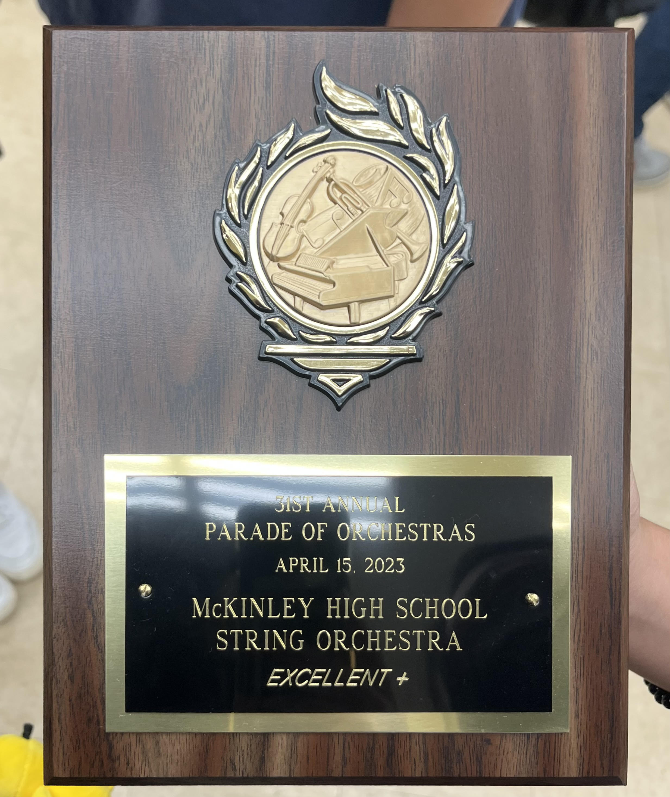

Parade of Orchestras is a noncompetitive festival held in April, where grade school and full orchestra ensembles from Hawaii participate. Two adjudicators provide comments and ratings for all performers. This event offers a great opportunity for each group to  perform in a formal setting, receive professional feedback, and watch other schools showcase their talents.

During my four years in orchestra at President William McKinley Highschool, our ensemble maintained a long streak of superior ratings. However, when COVID struck, the event was put on hold. My senior year marked our first chance at redemption. 

I was in the first violin section—the more advanced violin group—and served as a section leader. The first violinist has the responsibility to mentor classmates in the second violin section individually, while section leaders take on additional responsibilities to support the whole violin section, help classmates with their playing and comprehension of music, and lead group violin rehearsals. During the week of Parade of Orchestras, we have full orchestra rehearsals for a couple of hours every single week day up until D-day. After all of our hard work, we received an excellent+ which is still a very good rating. We were all proud of ourselves, especially since we have a new director along with this whole event being a first time experience for most of us. 

This experience is really valuable to me because as a group, we get to show our hard work, dedication, and talent for playing higher level pieces that we enjoy. I learned a lot about how other classmates work, leadership and teaching skills, communication, and how to play my own instrument better. Being able to work with people is one important skill to have and I am really grateful for having this opportunity to grow more as a person.
