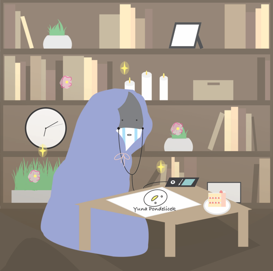

Note: This project was created in 2022 and at the time, my work was credited under Yuna Pondelicek, but I now go by Yuna Soo.

## Self Portrait
This is one of my first projects for my graphic design class, where we introduced ourselves through a self portrait created entirely with shapes in Adobe Illustrator. The design is all up to us, we can choose from a full body picture, half, or face perspective. Additionally, we need to include five symbols representing us, what our interests or hobbies are.

## Getting Started with the Design Process
This individual project helped us practice the graphic design process while becoming familiar with Adobe Illustrator. After reviewing the assignment requirements, I did some research on a few objects that described who I was at the time. I chose a strawberry cake, music, drawing, ducks, and a sleeping bag to show my personality and interest.

For the background, I chose an indoor setting with a bookshelf, showing myself sitting on the floor. I brainstormed multiple ways on how I can simplify each object into basic shapes and narrowed my ideas down to three designs. I put everything together in a rough draft and shaped everything together on Adobe Illustrator for my final draft. I participated in a peer review and exchanged feedback with a classmate. After some adjustments, I finalized my project by downloading two files, .AI and .png, and uploaded them to Google Classroom.

## Learning Experience
One of the biggest challenges was figuring out perspective, angles, and how to simplify complicated everyday objects into basic shapes. Through this project, I became more familiar with the layout on Adobe Illustrator, how to use a USB stick for transferring files, and practiced downloading and uploading specific file types. I also enjoyed seeing my classmates’ self portraits and learning about them through their artwork.
