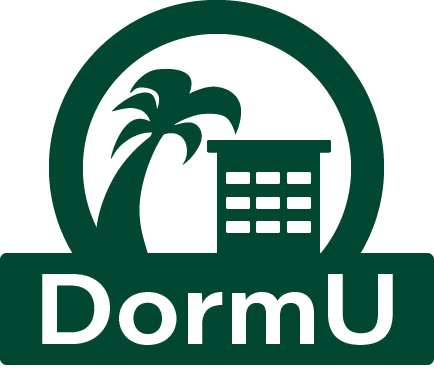

## What is DormU?
---
DormU is an web application that allows University of Hawaii at Manoa dormitory residents to easily communicate with other residents on the same floor of their building and as well as keeping touch with their resident assistant (RA). Each user customize a profile about themselves, posts their thoughts, and as well as connecting with other members of the community. This is my team’s final project using UI framework designs, CSS and HTML, React, NextJS, Prisma, Postgres, and Vercel.

The purpose of this application is to help the resident advisors build connections in the community throughout their floors and improve communication. One special feature in this application includes the availability to request and send mealshare points among other residents. With these point transactions, residents can share extra points they have to other residents who are in need.
  

## My Contribution
---
I worked mostly on deploying and consistently updating our web application to Vercel and handling bugs and errors in my team members' code. I also took part in designing and creating the contact page and helped with our project’s estimation and tracking. Since Vercel requires our Github organization a payment plan to sign up but let personal Github accounts have one repository have a free hobby plan, I took initiative into setting up and syncing our application to a live server. While constantly deploying my team’s updated version of our application, it caught many errors and bugs that we didn’t see in Visual Studio Code. It was an additional role for me to revise my team’s code and solve the problems while my teammates continue advancing forward to meet the milestone deadlines.
  

## What I learned
---

## Links
---
